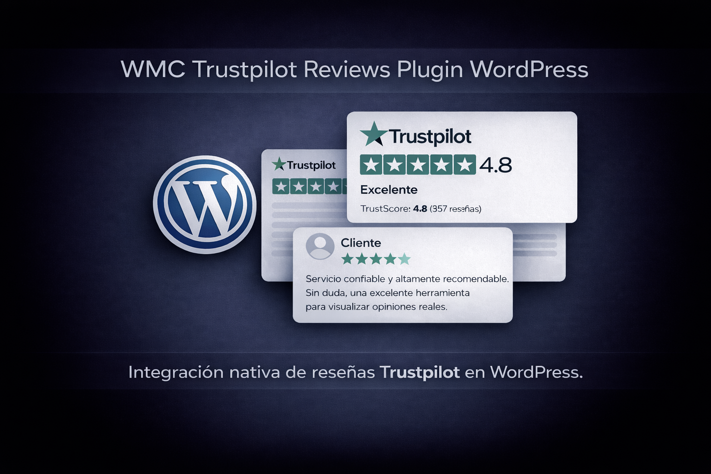

# WMC Trustpilot Reviews Plugin WordPress

Desarrollado por <a href="https://webmastercol.com/" target="_blank" rel="noopener noreferrer">Webmastercol</a>

---

## ¿Qué es este plugin?

Plugin desarrollado para incorporar la reputación de Trustpilot directamente en sitios WordPress, transformando reseñas externas en un activo visible de confianza dentro de la experiencia del usuario. La solución permite presentar prueba social real en distintos formatos, reforzando la credibilidad de la marca y acompañando los procesos de decisión del usuario.

---

## ¿Cómo aporta valor a la experiencia del usuario?

El plugin centraliza la obtención de reseñas desde Trustpilot y las traduce en vistas dinámicas como resumen de calificación, listados detallados y carruseles interactivos, adaptables a diferentes secciones del sitio. De esta forma, la información no se limita a un bloque estático, sino que se integra de manera coherente con el diseño y el recorrido del usuario.

---

## Integración visual y adaptabilidad

La implementación se apoya en shortcodes reutilizables y templates desacoplados, lo que facilita su uso en páginas, entradas o constructores visuales sin sacrificar control ni flexibilidad. Los estilos y comportamientos frontend se gestionan de forma independiente, garantizando consistencia visual y una experiencia fluida.

---

## Enfoque de desarrollo

Desde el punto de vista técnico, el proyecto está construido con una arquitectura modular orientada a clases, separando claramente la obtención de datos, la lógica de renderizado y la administración. Esto permite un mantenimiento limpio, extensibilidad futura y una base sólida para proyectos que requieren integrar servicios externos de reputación.

Este desarrollo refleja experiencia en creación de plugins avanzados para WordPress, integración de plataformas externas, diseño de soluciones orientadas a confianza digital y construcción de interfaces pensadas para reforzar la percepción de valor de una marca ante el usuario.

**Tecnologías y stack:** WordPress, PHP, JavaScript (vanilla), HTML/CSS, consumo de servicios externos, shortcodes, templates personalizados y arquitectura orientada a clases.
